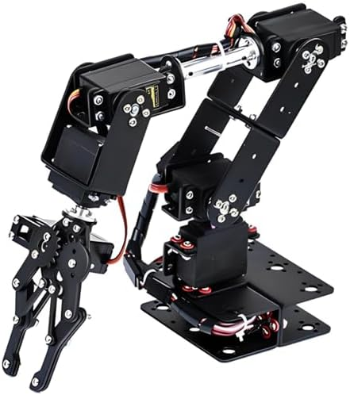
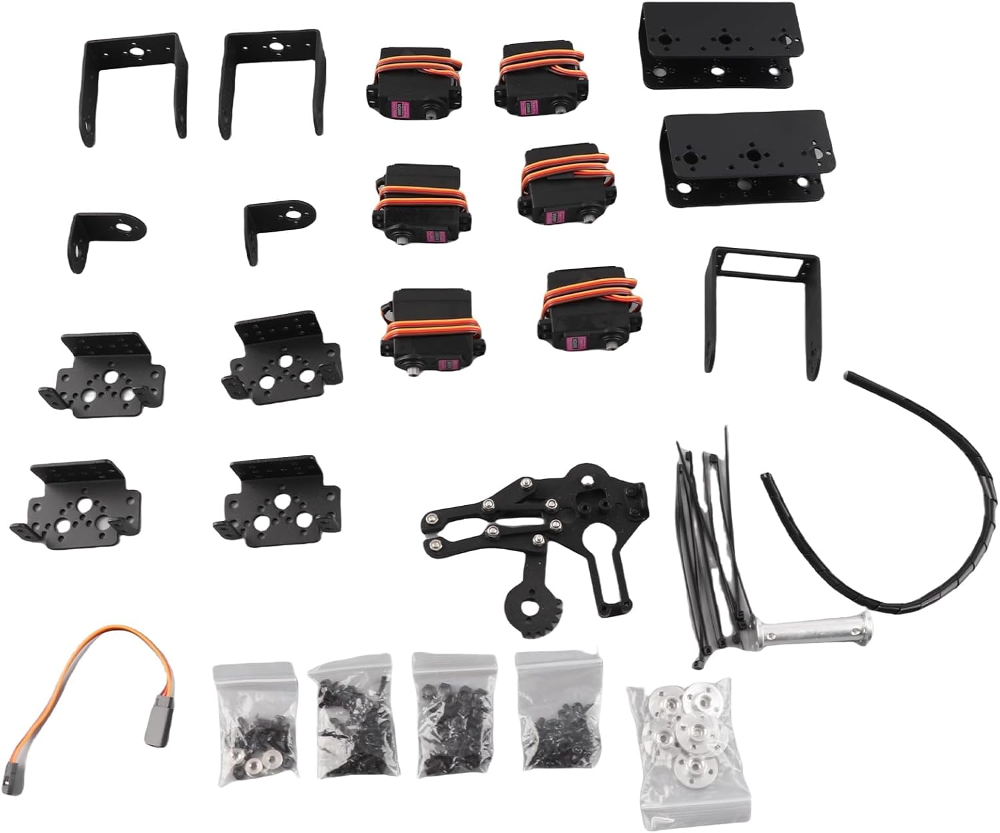
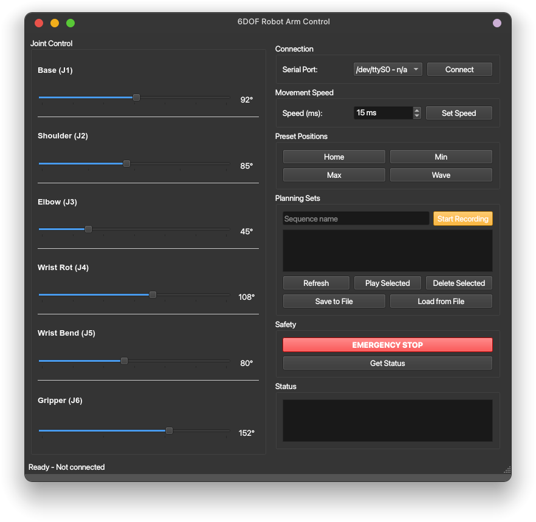

# 6DOF Robot Arm Serial Control System

A complete Arduino-based 6DOF robot arm control system with Python Qt6 GUI interface for easy control and monitoring.

**[Try the Interactive Demo](https://wokwi.com/projects/449667336179085313)** - Experience it online first!

## Table of Contents

- [Interactive Demo](#interactive-demo)
- [Features](#features)
- [Hardware Requirements](#hardware-requirements)
- [Software Requirements](#software-requirements)
- [Installation](#installation)
- [Project Structure](#project-structure)
- [Usage](#usage)
  - [Arduino Code](#arduino-code)
  - [Python GUI](#python-gui)
- [Serial Protocol](#serial-protocol)
  - [Commands (Python to Arduino)](#commands-python--arduino)
  - [Responses (Arduino to Python)](#responses-arduino--python)
- [Safety Features](#safety-features)
- [Sequence Management](#sequence-management)
- [Customization](#customization)
  - [Joint Limits](#joint-limits)
  - [Movement Speed](#movement-speed)
  - [Preset Positions](#preset-positions)
- [Keyboard Shortcuts](#keyboard-shortcuts)
- [Troubleshooting](#troubleshooting)
  - [Connection Issues](#connection-issues)
  - [Movement Issues](#movement-issues)
  - [GUI Issues](#gui-issues)
- [Development](#development)
  - [Adding New Features](#adding-new-features)
  - [Code Structure](#code-structure)
- [License](#license)
- [Contributing](#contributing)
- [Support](#support)

## Features

- **Serial Communication**: Text-based protocol at 115200 baud
- **Real-time Control**: Live joint position control with debounced sliders
- **Joint Limit Validation**: All commands checked against mechanical limits before execution
- **Safety Features**: Emergency stop (keyboard shortcut), movement validation
- **Preset Positions**: Home, Min, Max, Wave
- **Sequence Management**: Record, play, delete, save/load to file
- **Auto-reconnect**: GUI detects USB disconnection and reconnects automatically
- **Keyboard Shortcuts**: Esc for emergency stop, Ctrl+H for home, Ctrl+R for recording
- **Optimized Codebase**: Servo array architecture, char buffer serial input, compatible with Arduino Uno and Mega

## System Architecture


*Complete system architecture showing all components and data flows*

### Hardware Assembly

*Complete 6DOF robot arm assembly showing servo motor connections and mechanical structure*

### Component Layout

*Detailed view of robot arm components and joint configurations*

## Hardware Requirements

- **Arduino Uno** or **Arduino Mega** (recommended)
- 6DOF Robot Arm with servo motors
- USB cable for serial communication
- Servo motors connected to pins 4, 5, 6, 7, 8, 9

## Software Requirements

- Arduino IDE (for uploading code to Arduino)
- Python 3.8+
- PyQt6
- pyserial

## Installation

1. **Arduino Setup**:
   ```bash
   # For Arduino Uno:
   arduino-cli compile --fqbn arduino:avr:uno --build-path ../build_uno .
   arduino-cli upload -p /dev/ttyACM0 --fqbn arduino:avr:uno .

   # For Arduino Mega:
   arduino-cli compile --fqbn arduino:avr:mega --build-path ../build_mega .
   arduino-cli upload -p /dev/ttyACM0 --fqbn arduino:avr:mega .
   ```

2. **Python Dependencies**:
   ```bash
   pip install -r requirements.txt
   ```

## Interactive Demo

**Try it online first!** - No hardware required

Experience the 6DOF Robot Arm in your browser:
- [**Wokwi Online Simulator**](https://wokwi.com/projects/449667336179085313)
- Test all commands in real-time
- See servo movements visually
- Suitable for learning and testing

The system consists of layered architecture for reliable control:

**User Interface Layer** -> **Communication Layer** -> **Control Layer** -> **Hardware Layer**

For detailed system flow and component interactions, see the [complete system flowchart](assets/flowchart.mermaid).

## Project Structure

```
6DoF_arm/
├── .git/
├── .gitignore
├── code/
│   ├── code.ino            # Main Arduino sketch
│   └── config.h            # Configuration header (pins, limits, commands)
├── arm_control_gui.py      # Python Qt6 GUI application
├── requirements.txt        # Python dependencies
├── assets/
│   ├── flowchart.mermaid   # System architecture diagram source
│   ├── render.png          # Rendered architecture diagram
│   ├── gui.png             # GUI screenshot
│   ├── arm_assambler.jpg   # Assembly photo
│   └── arm_component.jpg   # Component photo
├── LICENSE
└── README.md
```

## Usage

### Arduino Code

The Arduino code (`code/code.ino` and `code/config.h`) provides:

- Serial communication at 115200 baud with char buffer input (no heap fragmentation)
- Joint control with limit validation against `JOINT_MIN[]` / `JOINT_MAX[]`
- Servo array architecture (no duplicated switch-case blocks)
- Emergency stop functionality
- Real-time position feedback
- Portable serial reading in `loop()` (works on all boards)

**Joint Pin Mapping**:
- Joint 1 (Base): Pin 9, range 0-180 degrees
- Joint 2 (Shoulder): Pin 8, range 30-150 degrees
- Joint 3 (Elbow): Pin 7, range 0-180 degrees
- Joint 4 (Wrist Rotation): Pin 6, range 0-180 degrees
- Joint 5 (Wrist Bend): Pin 5, range 0-180 degrees
- Joint 6 (Gripper): Pin 4, range 90-180 degrees

### Python GUI

Run the GUI application:

```bash
python arm_control_gui.py
```


*Python Qt6 GUI interface showing joint controls, preset positions, and status monitoring*

**GUI Features**:

1. **Connection Panel**:
   - Select serial port from dropdown
   - Connect/Disconnect button
   - Scan button to refresh available ports
   - Auto-reconnect on USB disconnection

2. **Joint Control**:
   - 6 sliders for individual joint control (J1-J6)
   - Real-time position display with min/max labels
   - Joint limits enforced automatically
   - Debounced slider commands (80ms) to prevent serial flooding

3. **Speed Control**:
   - Movement Speed: Configurable 5-200ms delay between steps
   - Real-time Adjustment: Change speed without restarting Arduino
   - Default: 15ms (optimized for smooth and fast movement)

4. **Preset Positions**:
   - Home: Default safe position
   - Min: Move all joints to minimum positions
   - Max: Move all joints to maximum positions
   - Wave: Friendly wave gesture (raises arm and waves left-right)

5. **Safety Controls**:
   - Emergency Stop: Immediately halts all movement (also via Esc key)
   - Get Status: Requests current position from Arduino

6. **Status Display**:
   - Real-time communication log (capped at 200 lines, oldest removed first)
   - Error messages and feedback

## Serial Protocol

### Commands (Python to Arduino)

```
J1:90        - Set joint 1 to 90 degrees (validated against limits)
J2:45        - Set joint 2 to 45 degrees
HOME         - Move to home position
MIN          - Move all joints to minimum positions
MAX          - Move all joints to maximum positions
WAVE         - Perform friendly wave gesture
SET_SPEED:15 - Set movement speed to 15ms (5-200ms range)
STOP         - Emergency stop
STATUS       - Request current positions
```

### Responses (Arduino to Python)

```
OK:J1:90,J2:45,J3:0,J4:108,J5:80,J6:152    - Current positions
ERROR:Joint 2 range is 30-150                  - Limit violation
ERROR:Unknown command: XYZ                     - Command error
SEQUENCE:                                      - Sequence list header
0:MySequence                                   - Sequence entry
```

## Prebuilt Command Testing

### Basic Movement Commands

**Individual Joint Control:**
```bash
J1:90      # Move base to 90 degrees
J2:45      # Move shoulder to 45 degrees
J3:60      # Move elbow to 60 degrees
J4:120     # Move wrist rotation to 120 degrees
J5:80      # Move wrist bend to 80 degrees
J6:150     # Move gripper to 150 degrees
STATUS     # Check current positions
```

**Position Commands:**
```bash
HOME       # Move to home position (92,85,45,108,80,152)
STATUS     # Verify home position
MIN        # Move to minimum positions (0,30,0,0,0,90)
STATUS     # Verify minimum positions
MAX        # Move to maximum positions (180,150,180,180,180,180)
STATUS     # Verify maximum positions
WAVE       # Perform friendly wave gesture
STATUS     # Verify position after wave
STOP       # Emergency stop (if needed)
```

**Speed Control:**
```bash
SET_SPEED:15   # Set fast/smooth movement (15ms delay)
SET_SPEED:50   # Set normal movement (50ms delay)
SET_SPEED:100  # Set slow/precise movement (100ms delay)
SET_SPEED:3    # Error: below minimum (5ms)
SET_SPEED:250  # Error: above maximum (200ms)
```

### Joint Limits Testing

**Valid Ranges:**
```bash
J1:0       # Base minimum
J1:180     # Base maximum
J2:30      # Shoulder minimum (mechanical limit)
J2:150     # Shoulder maximum (mechanical limit)
J3:0       # Elbow minimum
J3:180     # Elbow maximum
J6:90      # Gripper minimum
J6:180     # Gripper maximum
```

**Error Testing:**
```bash
J1:200     # Error: over 180 degrees
J2:10      # Error: under 30 degrees
J2:160     # Error: over 150 degrees
J6:50      # Error: under 90 degrees
J7:90      # Error: invalid joint number
```

### Sequence Commands

**Recording Sequences:**
```bash
RECORD_START:0:PickSequence   # Start recording sequence 0
J1:45                         # Record base movement
J2:90                         # Record shoulder movement
J3:135                        # Record elbow movement
J4:60                         # Record wrist rotation
RECORD_STOP                   # Stop recording
LIST_SEQUENCES               # Verify sequence saved
```

**Playing Sequences:**
```bash
PLAY_SEQUENCE:0              # Play recorded sequence
STATUS                       # Check final position
```

**Sequence Management:**
```bash
LIST_SEQUENCES               # Show all sequences
DELETE_SEQUENCE:0            # Delete sequence 0
LIST_SEQUENCES               # Verify deletion
```

### Arduino Serial Monitor Setup

1. **Upload code** to Arduino Uno/Mega
2. **Open Serial Monitor** (Tools -> Serial Monitor)
3. **Set baud rate** to `115200`
4. **Line ending** to `Newline` or `Both NL & CR`
5. **Send commands** one by one and observe responses

### Complete Test Sequence

```bash
# Initial status
STATUS

# Test individual joints
J1:90
STATUS
J2:45
STATUS
J3:60
STATUS

# Test home command
HOME
STATUS

# Test wave command
WAVE
STATUS

# Test emergency stop
J1:180
STOP
STATUS

# Test sequence recording
RECORD_START:0:TestMove
J1:30
J2:80
J3:120
RECORD_STOP

# Test sequence playback
LIST_SEQUENCES
PLAY_SEQUENCE:0
STATUS

# Clean up
DELETE_SEQUENCE:0
LIST_SEQUENCES
```

## Benchmark Results

### Arduino Uno (Optimized)
- **Flash Usage**: ~29% (9500/32256 bytes)
- **RAM Usage**: ~81% (1675/2048 bytes)
- **Status**: Reliable, all features functional
- **Movement Speed**: Configurable 5-200ms (default 15ms)
- **Sequences**: 2 sequences x 15 waypoints each
- **Commands**: HOME, MIN, MAX, WAVE, SET_SPEED, full sequence control

### Arduino Mega (Optimized)
- **Flash Usage**: ~4% (10660/253952 bytes)
- **RAM Usage**: ~21% (1786/8192 bytes)
- **Status**: Full headroom, recommended for expansion
- **Movement Speed**: Configurable 5-200ms (default 15ms)
- **Sequences**: 2 sequences x 15 waypoints each
- **Commands**: HOME, MIN, MAX, WAVE, SET_SPEED, full sequence control

## Safety Features

- **Joint Limit Validation**: Every angle command is checked against `JOINT_MIN[]` and `JOINT_MAX[]` before servo movement. Out-of-range values return an error with the valid range.
- **Angle Clamping**: Internal movement functions clamp angles to valid range as a secondary safeguard.
- **Emergency Stop**: Immediate halt of all movements via button or Esc key.
- **Command Validation**: All commands are validated for format and parameters before execution.
- **Movement Interruption**: Emergency stop can interrupt ongoing movements including sequence playback.

## Sequence Management

The system supports creating and managing movement sequences for automated operations.

### Recording Sequences

1. Enter a sequence name in the text field
2. Click "Start Recording" or press Ctrl+R (button turns red)
3. Move joints using sliders - each movement is recorded as a waypoint
4. Click "Stop Recording" or press Ctrl+R again when finished

### Managing Sequences

- **Play**: Execute the selected sequence from the list
- **Delete**: Remove the selected sequence
- **Refresh**: Update the sequence list from Arduino
- **Save to File**: Export current positions and sequence list to JSON
- **Load from File**: Import positions and speed from JSON, send to Arduino

### Sequence Protocol

```
RECORD_START:sequence_index:name    - Start recording sequence
RECORD_STOP                        - Stop recording
PLAY_SEQUENCE:sequence_index       - Play recorded sequence
LIST_SEQUENCES                     - Get list of sequences
DELETE_SEQUENCE:sequence_index     - Delete sequence
```

### Arduino Storage

- **Capacity**: Up to 2 sequences in Arduino memory
- **Length**: Each sequence can have up to 15 waypoints
- **Persistence**: Sequences are stored in RAM (lost on power cycle)

## Keyboard Shortcuts

| Shortcut | Action |
|---|---|
| Esc | Emergency Stop |
| Ctrl+H | Move to Home position |
| Ctrl+R | Start/Stop recording |
| Ctrl+Shift+C | Connect/Disconnect serial |

## Customization

### Joint Limits

Modify `JOINT_MIN` and `JOINT_MAX` in `code/config.h`:

```cpp
const int JOINT_MIN[NUM_JOINTS] = {0, 30, 0, 0, 0, 90};
const int JOINT_MAX[NUM_JOINTS] = {180, 150, 180, 180, 180, 180};
```

Also update `JOINT_LIMITS` in `arm_control_gui.py` to match.

### Movement Speed

**Via Serial Commands:**
```bash
SET_SPEED:15   # Fast and smooth (default)
SET_SPEED:50   # Normal speed
SET_SPEED:100  # Slow and precise
```

**Via GUI:**
- Use the speed control spinbox (5-200ms range)
- Click "Set" to apply changes immediately

**Arduino Code Default (in `config.h`):**
```cpp
#define DEFAULT_MOVE_SPEED 15
#define MIN_MOVE_SPEED 5
#define MAX_MOVE_SPEED 200
```

### Preset Positions

Modify `HOME_POSITIONS` in `code/config.h` and `HOME_POSITIONS` in `arm_control_gui.py`.

## Troubleshooting

### Connection Issues

1. Check that Arduino Uno/Mega is connected (`arduino-cli board list`)
2. Verify correct port selection (typically `/dev/ttyACM0` or `/dev/ttyUSB0`)
3. Ensure Arduino code is uploaded and running
4. Check serial baud rate (115200)
5. If the GUI shows "Connection lost", it will auto-reconnect when the port reappears

### Movement Issues

1. Verify servo connections: pins 4, 5, 6, 7, 8, 9 on both Uno and Mega
2. Check servo power supply (adequate current for 6 servos)
3. Confirm joint limits are appropriate for your arm
4. Test individual joints with manual commands
5. Check for "ERROR:Joint N range is X-Y" messages indicating limit violations

### GUI Issues

1. Ensure PyQt6 and pyserial are installed
2. Check Python version (3.8+ required)
3. Run GUI with proper display (not headless)
4. If sliders feel unresponsive, the 80ms debounce is working as intended

## Development

### System Documentation

- **Complete System Flowchart**: [View detailed Mermaid flowchart](assets/flowchart.mermaid)
  - User interface interactions
  - Serial communication protocol
  - Command processing flows
  - Hardware control sequences
  - Safety and validation systems
  - Sequence management operations

- **Rendered Flowchart**: [View rendered flowchart diagram](assets/render.png)
  - Visual representation of system architecture
  - Component relationships and data flows
  - Hierarchical organization of system layers

### Adding New Features

- **New Commands**: Add to `processCommand()` in `code/code.ino`
- **New GUI Elements**: Extend `_build_right_panel()` in `arm_control_gui.py`
- **Additional Safety**: Add validation in `clampAngle()` or `processJointCommand()`

### Code Structure

- **Arduino**: Servo array, char buffer input, modular command processing
- **Python**: Object-oriented Qt6 application with threaded serial I/O
- **Communication**: Text protocol with debounced slider commands
- **Compatibility**: Tested and optimized for Arduino Uno and Mega

## License

This project is licensed under the MIT License - see the [LICENSE](LICENSE) file for details.

## Contributing

Contributions welcome! Please:

1. Fork the repository
2. Create a feature branch
3. Submit a pull request

## Support

For issues and questions:

1. Check the troubleshooting section
2. Review the serial protocol documentation
3. Open an issue on GitHub

---

**Note**: Always test safety features before operating with real hardware. Ensure proper power supplies and mechanical constraints to prevent damage to equipment or injury.
